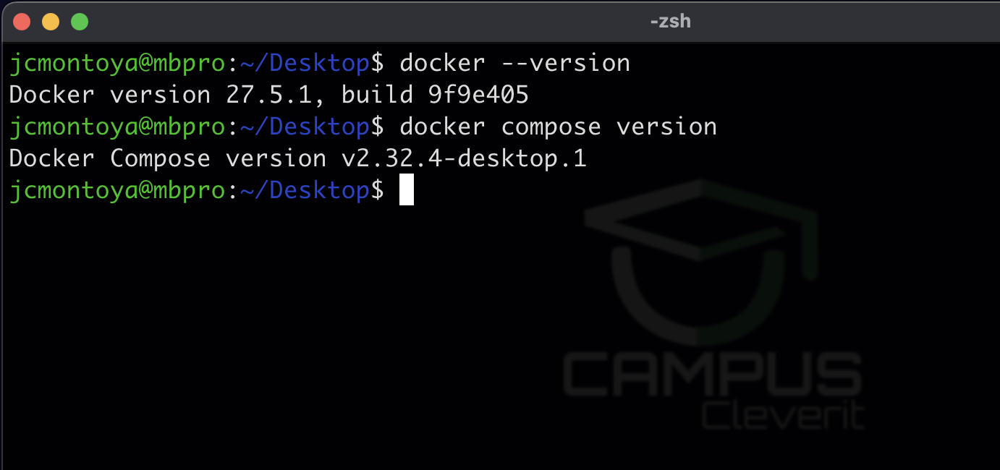
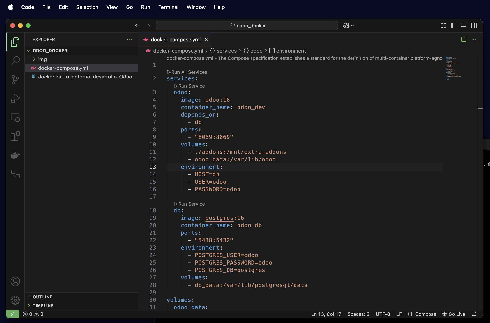
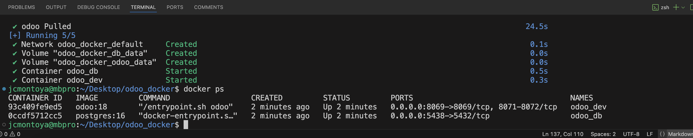
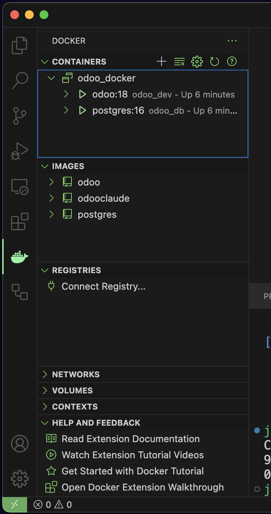
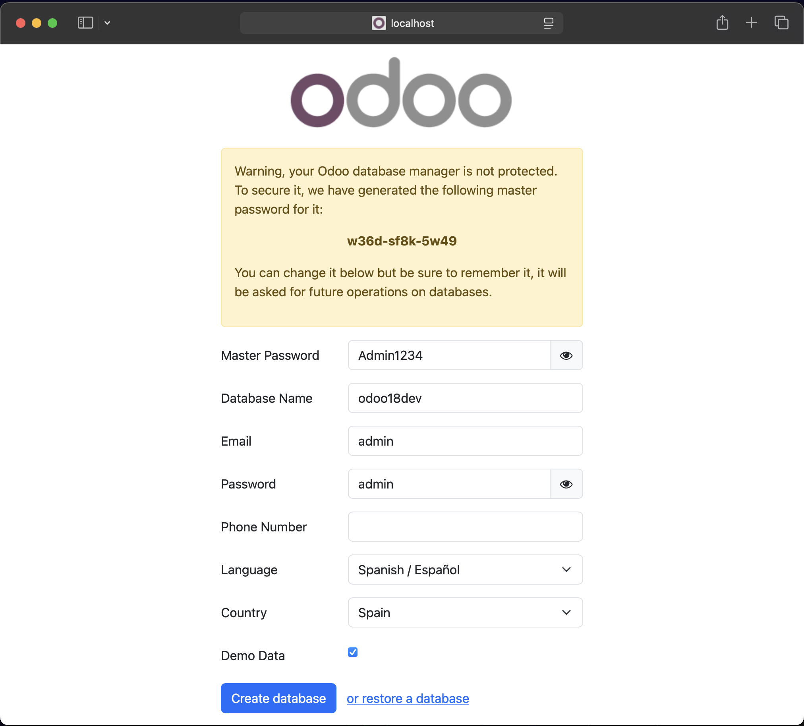
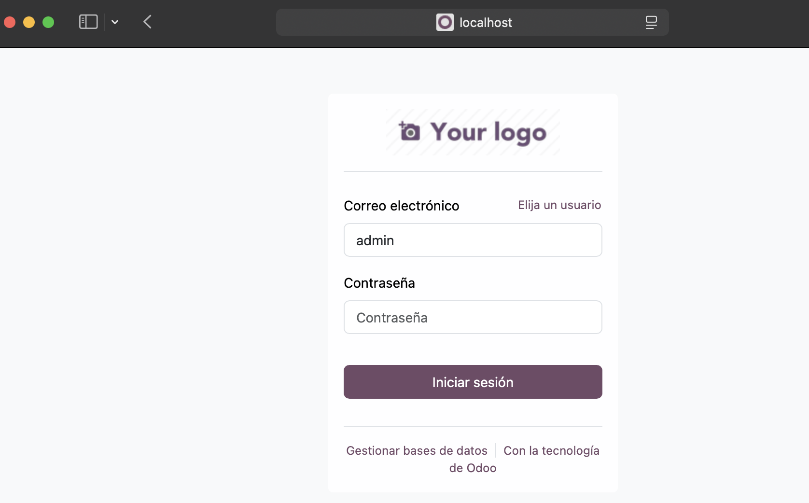
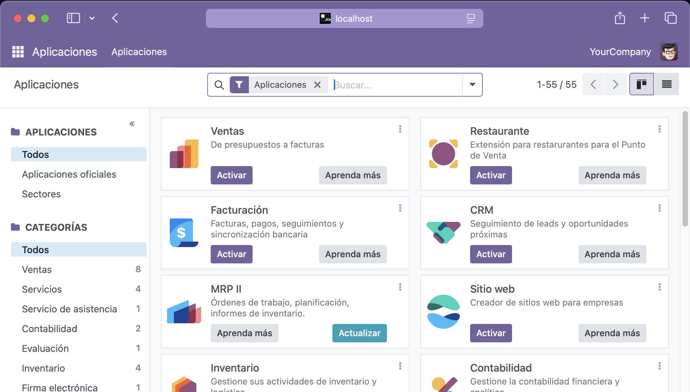

# 🚀 Workshop: Dockeriza tu Desarrollo en Odoo

## 🛠️ Introducción

En este workshop aprenderás a configurar un entorno de desarrollo en Odoo utilizando **Docker y Docker Compose**. Al final, tendrás un ambiente portable y estable sin necesidad de configurar dependencias manualmente en tu equipo.

---


## 📌 ¿Por qué Docker?

- Evitas conflictos de dependencias en tu sistema.
- Fácil de replicar en otros entornos.
- Rápido para crear, resetear y eliminar entornos de prueba.
- Configuración centralizada con `docker-compose.yml`.

---

## 🔧 Requisitos  

Antes de comenzar, necesitas instalar Docker en tu sistema operativo.  

### 🖥️ Windows & macOS  
Es obligatorio instalar **Docker Desktop**, ya que proporciona una interfaz gráfica y la funcionalidad de Docker Compose integrada.  

🔗 **Descargar Docker Desktop**  
👉 [https://www.docker.com/products/docker-desktop](https://www.docker.com/products/docker-desktop)  

> **Nota:** En Windows, asegúrate de habilitar WSL 2 para mejor rendimiento.  
> [Guía de instalación de WSL 2](https://learn.microsoft.com/en-us/windows/wsl/install)  

### 🐧 Linux  
En Linux puedes elegir entre:  
1. **Docker Engine** (más ligero, sin interfaz gráfica).  
2. **Docker Desktop** (con interfaz gráfica, pero más pesado).  

🔗 **Instalar Docker Engine en Linux**  
👉 [https://docs.docker.com/engine/install/](https://docs.docker.com/engine/install/)  

🔗 **Instalar Docker Desktop en Linux**  
👉 [https://docs.docker.com/desktop/install/linux-install/](https://docs.docker.com/desktop/install/linux-install/)  

> **Verificar instalación:** Después de instalar, ejecuta: 

```sh
docker -v  # Debe mostrar la versión instalada
docker compose version  # Debe mostrar la versión de Docker Compose
```

**Resultado:**




---

## 📦 **2. Creación del proyecto `docker-compose.yml`**

Crea un directorio en tu sistema (Tus Documentos o dentro del Escritorio) lo puedes llamar por ejemplo **"odoo_docker"**, crea un archivo `docker-compose.yml` con el siguiente contenido:

```yaml

services:
  odoo:
    image: odoo:18
    container_name: odoo_dev
    depends_on:
      - db
    ports:
      - "8069:8069"
    volumes:
      - ./custom_addons:/mnt/extra-addons
      - odoo_data:/var/lib/odoo
    environment:
      - HOST=db
      - USER=odoo
      - PASSWORD=odoo

  db:
    image: postgres:16
    container_name: odoo_db
    ports:
      - "5438:5432"
    environment:
      - POSTGRES_USER=odoo
      - POSTGRES_PASSWORD=odoo
      - POSTGRES_DB=postgres
    volumes:
      - db_data:/var/lib/postgresql/data

volumes:
  odoo_data:
  db_data:

```

**Explicación:**
- Se definen dos contenedores: **Odoo** y **PostgreSQL**.
- Se mapean los puertos 8069 (para acceder a Odoo) y 5432 (para la base de datos).
- Se crean volúmenes persistentes para la base de datos y los módulos personalizados.

## 🛠️ Entorno de Desarrollo con VS Code  
Para manejar el proyecto de forma eficiente, te recomiendo usar **Visual Studio Code (VS Code)**, ya que es el editor de código más utilizado hoy en día y es gratuito.  

🔗 **Descargar VS Code**  
👉 [https://code.visualstudio.com/](https://code.visualstudio.com/)  

### 📌 Instalación de extensiones recomendadas  
Una vez instalado VS Code, instala las siguientes extensiones para mejorar tu flujo de trabajo con Docker y Python:  
✅ **Python**: Para resaltar la sintaxis y ejecutar scripts dentro de Odoo.  
✅ **Docker**: Para administrar contenedores directamente desde VS Code.  

### 📂 Abrir el Proyecto con VS Code  
1. Abre VS Code.  
2. Haz clic en **Archivo > Abrir Carpeta** (Ctrl + K, Ctrl + O).  
3. Selecciona la carpeta `odoo-docker` que creaste anteriormente.  
4. ¡Listo! Ahora puedes editar tu `docker-compose.yml` y gestionar tu entorno de desarrollo con mayor comodidad.  

---

**Resultado:**


---

## 🚀 **3. Levantar los Contenedores**

Ejecuta el siguiente comando en la terminal dentro del directorio donde creaste `docker-compose.yml`
puedes usar el terminal integrado de VScode (Control + J)(CMD + J) o desde el Menu Terminal / nuevo:

```sh
docker compose up -d
```
Esto descargará las imágenes necesarias y levantará los contenedores en segundo plano (toma entre 1-5 minutos la primera vez).

Para verificar que están corriendo:

```sh
docker ps
```

**Resultado:**



Tambien puedes ver los contendores e imagenes usando la extension Docker en VScode para mayor facilidad si eres mas de interfaz gráfica:
Con clic derecho sobre un contendor
podras detener, reiniciar, etc.



---

## 🛠️ **4. Acceder a Odoo y Crear una Base de Datos**

1. Abre tu navegador y ve a `http://localhost:8069`
2. Configura una nueva base de datos con los siguientes datos:
   - **Nombre:** `odoo18dev`
   - **Usuario:** `admin`
   - **Contraseña:** `admin`
   - **Localización:** `Idioma y pais`
   - **Demo:** `Crea la db en modo demo con registros de ejemplo.`
3. Haz clic en "Crear base de datos".

**Imagen a insertar:** Captura de la pantalla de creación de base de datos en Odoo.



Genial!, ya puedes Iniciar sesion e instalar tus apps
de preferencia





---

## 🔄 **5. Montar Módulos Personalizados**

Para agregar módulos personalizados, coloca tus Apps en el directorio `custom_addons/` dentro de la misma carpeta donde creaste `docker-compose.yml`.

Luego, reinicia Odoo desde el terminal de VSCODE para que reconozca los nuevos módulos:

```sh
docker-compose restart
```

**Imagen a insertar:** Captura del explorador de archivos mostrando la carpeta `custom_addons/` con un módulo dentro.

---

## ✅ **6. Detener y Eliminar Contenedores**

Para detener los contenedores sin eliminarlos:

```sh
docker-compose stop
```

Para eliminarlos solo los contenedores:

```sh
docker-compose down
```

Para eliminarlos completamente junto con los volúmenes:

```sh
# perderás todos los datos almacenados de Odoo y PG
docker-compose down -v
```

---

## Tutoriales (Extra)

[Descargar Instalar Docker Desktop](https://youtu.be/CtUOsIiVJwc?feature=shared)

[Instalar Docker Engine en Linux](https://youtu.be/ddMrJqO09Nk?feature=shared)

## 🎯 **Conclusión**

¡Felicidades! Ahora tienes un entorno de desarrollo en Odoo **dockerizado, portable y fácil de manejar**. Esto te permitirá probar nuevas versiones sin miedo y trabajar de manera más eficiente.

Si te interesa aprender más sobre desarrollo backend en Odoo, revisa nuestro curso avanzado **"Odoo 18 Backend Pro"**. 🚀

